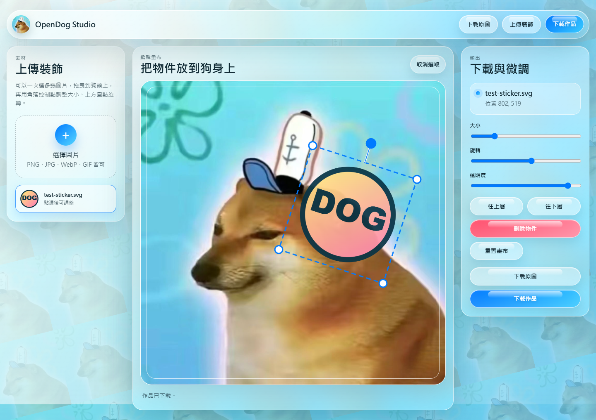

# OpenDog Studio

一個用 Flask 製作的狗頭像客製化工具。網頁會使用 `static/assets/dog.jpg` 當作斜角拼貼背景、原圖下載來源，以及中央編輯畫布的底圖。

## 功能

- 下載原始狗照片
- 上傳多張圖片作為裝飾素材
- 在狗頭畫布上拖曳、縮放、旋轉、調整透明度
- 調整圖層上下順序、刪除物件、重置畫布
- 下載合成後的 PNG 作品
- 預設服務 port：`5487`

## 本機直接執行

```powershell
py -m venv .venv
.\.venv\Scripts\Activate.ps1
pip install -r requirements.txt
python app.py
```

打開：

```text
http://127.0.0.1:5487
```

## Docker 執行

```powershell
docker build -t opendog-studio .
docker run -d --name opendog-studio -p 5487:5487 opendog-studio
```

打開：

```text
http://127.0.0.1:5487
```

## 讓別人連進來

如果你的電腦有固定內網 IP，例如 `192.168.1.50`，同一個 Wi-Fi 或區域網路的人可以開：

```text
http://192.168.1.50:5487
```

如果要讓外網的人連進來：

1. 確認這台電腦固定 IP 不會變。
2. 在 Windows 防火牆開放 TCP `5487` 入站。
3. 在路由器設定 Port Forwarding，把外部 TCP `5487` 轉發到這台電腦的 TCP `5487`。
4. 外部使用者用 `http://你的固定公網IP:5487` 連線。

如果你的 ISP 使用 CGNAT，外部 port forwarding 可能無法直接生效，這時需要請 ISP 提供真正的固定公網 IP，或改用 Cloudflare Tunnel、Tailscale、ngrok 這類通道服務。
